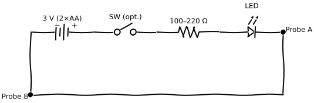

The continuity tester is a battery-powered LED circuit that lights up when both probes touch a low-resistance path. Use it to check wires for breaks, confirm a switch opens and closes properly, verify a fuse element, or trace connections on an unpowered board. You can build a working version in an hour from parts in a bag of mixed PCB salvage and a spare AA battery holder.

This is not a replacement for a multimeter. It can't measure resistance, display voltage, or distinguish between a 10-ohm path and a direct short. What it gives you is a fast go/no-go light with no menus, no auto-ranging, and nothing to switch on when you pick it up. That makes it genuinely useful for a class of quick checks where you'd otherwise have to hunt for your meter, switch modes, and interpret a reading.

To build the version described here you'll need an LED and a through-hole resistor from any low-voltage PCB, an AA x 2 battery holder from a dead battery device, a short length of flexible wire, and a momentary switch if you want one.

## What it does

A continuity tester answers one question: do these two points share a low-resistance path? Light on means yes. No light means no. That's the whole instrument.

At 3 V from two AA cells, the circuit will show continuity through anything under roughly 200–300 ohms before the LED becomes too dim to read. That covers wire, switch contacts, fuse elements, motor windings, and most connector pins. It will glow faintly through a forward-biased diode, so the multimeter's diode mode is a better tool for checking diodes. It won't light through a capacitor unless the cap has failed and shorted internally.

One limitation matters for safe use: this tester works only on de-energised, discharged circuits. It puts 3 V across the path under test, which is harmless in almost all cases. But touching the probes to a partially energised circuit or a capacitor with stored charge doesn't just give a wrong reading. It can damage the tester or surprise you. Treat it as a dead-circuit tool only.

## Parts to salvage

| Part | Where to get it |
|------|-----------------|
| Through-hole LED, any colour | Battery devices, front panel or light-pipe; Routers and modems, indicator row |
| Through-hole resistor, 100–220 Ω | Desktop computers, motherboard or riser card; Routers and modems, main PCB |
| AA × 2 battery holder with leads | Battery devices, rear shell or battery tray |
| Momentary push or tact switch | Battery devices, board edge; Routers and modems, reset switch |
| Flexible insulated wire, 22–26 AWG | Any low-voltage PCB; cut lead wire from dead boards |
| Small enclosure | A dead toy or remote shell from battery devices; or a scrap project box |

Alligator clip leads are worth buying rather than improvising from bare wire. The tool becomes frustrating to use when probes slip off pads. A set of ten clips costs almost nothing and they're handy for every other bench task too. Banana sockets mounted in the enclosure are the cleanest option if you want to swap probe leads.

Through-hole resistors from desktop computer motherboards or 1990s–2000s consumer electronics are easy to identify by their colour bands and come off with a basic iron. Skip SMD resistors from modern boards unless you have the equipment to remove them cleanly.

## Build layout

The circuit is a series loop: battery positive runs through an optional switch, then through the resistor, through the LED (anode to cathode), to probe A. Battery negative goes to probe B. When both probes touch a conductive path, the loop closes and the LED lights.

<figure>
  
  <figcaption>Continuity tester circuit: battery, series resistor, and LED in a loop. Touch Probe A and Probe B to the path under test to complete the circuit.</figcaption>
</figure>

Before soldering anything permanent, lay the circuit out on a breadboard.

1. Push the LED into the breadboard with the longer lead (anode) where you'll connect the resistor. If you're unsure which lead is the anode, check it with your multimeter on diode mode: the meter will show a forward voltage with the red lead on the anode (typically around 2.0 V for red or yellow LEDs, 2.2 V for green, or 3.2 V for blue or white).
2. Connect the resistor between the anode row and the positive supply row.
3. Run a wire from the LED cathode (shorter lead) to the negative supply row.
4. Clip the battery holder positive lead to the positive rail and the negative lead to the negative rail.
5. Touch the two probe wires together. The LED should light clearly. If it's very dim, your resistor may be too large for your LED. Drop from 220 Ω to 100 Ω.
6. If the LED doesn't light at all, flip it around. Getting the polarity backwards here is the most common first-build mistake.

The breadboard version is functional, but the probe leads pull out under normal handling. If you'll use this tool regularly, the permanent version is worth the extra twenty minutes.

For the permanent build, a short length of stripboard is easier than point-to-point wiring. Cut a strip wide enough for five or six holes per rail, solder the LED and resistor in series across two rails, and run flying leads for the probe wires and battery connection. Use heat-shrink tubing on any exposed junctions.

Drill a hole in the enclosure face for the LED lens and two smaller holes for the probe leads. A knot in each lead inside the enclosure is all the strain relief you need. Mark the anode lead of the LED with a felt-tip dot before placing it in the enclosure. Reversing the polarity at this stage after getting it right on the breadboard is an easy mistake to make.

## Test and use

Before fitting the batteries, check that the probe lead insulation is intact and that no bare wire is touching anything it shouldn't be.

1. Fit the batteries and touch both probe tips together. The LED should light clearly at full brightness. If it glows only faintly, the series resistor is limiting current too much. Swap to the next lower standard value.
2. Pull the probes apart. The LED should go off immediately. A faint glow with the probes open means a solder bridge or stray connection in the build. Find it before trusting the tool.
3. Touch the probes to both ends of a short length of known-good wire. Brightness should match the direct-short test. Lower brightness means high resistance at a connection, not necessarily a broken wire.
4. Test a known-good switch: probes across the contacts, switch open and LED off, switch closed and LED on. If there's no change in either state, the switch has failed.

In use, always confirm the circuit you're testing is unpowered and that any capacitors in it are discharged before connecting the probes. The tester will forward-bias diodes and give false continuity readings on components that are still partially charged. If you're tracing a board that was recently powered, wait a minute and recheck.

Don't use this tester on wiring from mains-connected devices without confirming the circuit is fully isolated. The 3 V from the batteries won't protect you from stored charge on a capacitor or an incompletely isolated mains path.

## Theory links and upgrades

For the theory behind current, resistance, and why the series resistor is needed, see [DC measurements](/open-circuits/DC/DC_5.html).

For working through LED and battery series circuits with a meter, the bench experiments in [experiments](/open-circuits/Exper/EXP_2.html) cover exactly what you just built.

Add a piezo buzzer in parallel with the LED so you get audio feedback without looking away from the board. Replace the standard LED with a two-colour red/green unit (common cathode) and a second resistor, so the tester shows one colour through very low resistance and another through slightly higher resistance. Try a 9 V battery with a 470 Ω resistor if you want a brighter indication and have no other use for the AA holder. Add a small toggle switch between two different series resistors (100 Ω and 470 Ω) to roughly distinguish direct shorts from resistive paths.
