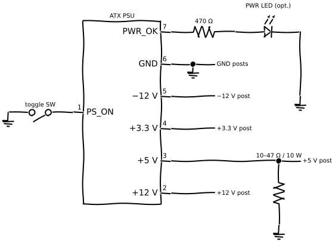

An ATX bench supply routes the existing low-voltage output rails of a salvaged computer power supply to labeled binding posts on the outside of its case. The finished unit provides +12 V, +5 V, +3.3 V, and −12 V. At the current ratings a modern ATX supply was built for, typically 15–20 A on the 12 V and 5 V rails, it has more current capacity than most entry-level bench supplies and costs nothing once you have the PSU.

The PSU case stays sealed throughout. All the work is on the output harness on the low-voltage side. The mains inlet, the primary circuitry, and the protective earth connection inside the case stay exactly as built. If you ever need to inspect the primary section or discharge the input caps, follow the procedure in the [ATX Power Supplies guide](/salvage/donor-guides/07-atx-power-supplies.html) before opening the case.

A few limits to state upfront: no variable voltage, no current-limiting mode, and the rails have cross-regulation dependencies that mean a heavy load on one rail can drag adjacent rails a few percent off nominal. Use this supply for digital logic, fans, motors, and experiments where precise voltage and current limiting aren't the point. For testing components where a runaway fault would burn them, a variable bench supply with a CC mode is the safer choice.

## Project goal

The standard ATX color code assigns fixed functions to each wire. Yellow is +12 V, red is +5 V, orange is +3.3 V, blue is −12 V, and black is COM. A single green wire labeled PS_ON controls startup: pulling it to COM turns the supply on, and letting it float keeps it in standby. That standby rail, the purple 5 V SB wire, stays live any time the mains is connected, regardless of the PS_ON state.

The −12 V rail is available and useful for op-amp experiments that need a negative supply, but its current rating is low, typically 0.5–1 A even on a hefty unit. Don't plan to run motors or high-current loads from it.

The PSU's fan stays in the case, connected to its original header, cooling the board exactly as designed. The fan does not need any modification. If it spins, the thermal path is intact.

## Parts to salvage

| Part | Where to get it |
|------|-----------------|
| ATX power supply, 300 W or more | Desktop computers, PSU bay; test it before converting |
| SPST toggle or rocker switch, any low-voltage DC rating | Desktop computers, front-panel board; or any dead appliance |
| Power-good indicator LED | Desktop computers, front-panel board |
| Through-hole resistor, 470 Ω, 1/4 W (for LED) | Desktop computers, motherboard; any low-voltage PCB |
| Wirewound resistor, 10 Ω–47 Ω, 5–10 W (dummy load) | ATX Power Supplies, secondary PCB area |

Buy the binding posts new. You need at least eight (one each for +12 V, +5 V, +3.3 V, −12 V, and two or more for COM/GND). The 12 V and 5 V posts need to handle the rail's rated current continuously, so choose posts rated 20–30 A. Standard M4 banana-post terminals from any electronics supplier cover this. Color-coded sets make the bench supply much less confusing in use.

Also buy a pack of ring or spade terminals if your binding posts won't accept bundled wire directly. Most M4 posts accept 2–3 individual wires, but four or more wires bundled for the 12 V rail will need a crimped junction.

## Conversion plan

<figure>
  
  <figcaption>ATX bench supply wiring overview: PS_ON switch, dummy load on +5 V, and the four output rails brought out to binding posts.</figcaption>
</figure>

Start with the paperclip test. This confirms the supply works before you invest any time in modifying it.

1. Place the PSU on your bench with the harness clear of anything conductive. Don't touch the harness while it's plugged in.
2. Find the 20/24-pin ATX main connector and identify the green PS_ON wire and any adjacent black COM wire.
3. Plug the supply into mains. Bridge the green PS_ON wire to the black COM wire with an insulated paperclip or a folded piece of tape-covered wire. The fan should spin within a second.
4. Set your multimeter to DC volts. Measure yellow to black: you should read 11.4–12.6 V. Measure red to black: 4.75–5.25 V. Measure orange to black: 3.1–3.4 V.
5. If any rail reads outside those tolerances, don't use this PSU. The regulator is failing and the conversion won't fix it.
6. Unplug from mains, wait 30 seconds, then remove the paperclip.

With the supply confirmed good, unplug it from mains and leave it for two minutes before handling the harness. The 5 V SB rail holds a low charge briefly after unplugging.

7. Cut the 20/24-pin main connector and the 4/8-pin CPU connector from the harness. Leave at least 150 mm of wire beyond where you cut. You'll use these wires to reach the binding posts.
8. Sort the cut wires by color. Set aside: all yellow (+12 V), all red (+5 V), all orange (+3.3 V), one green (PS_ON), one blue (−12 V), all black (COM). If you want the standby rail available, keep one purple wire. Cut the gray PWR_OK wire to about 60 mm if you're adding a power indicator LED, or tuck it aside if not.
9. Bundle matching-color wires together and strip 8–10 mm from the end of each bundle. A 24-pin ATX connector typically has four yellow wires and four red wires. Bundle the four yellows as the +12 V feed, the four reds as the +5 V feed, and two or three oranges as the 3.3 V feed. Bundle all remaining black wires as COM.
10. Connect the PS_ON switch: one terminal of the switch to the green wire, the other terminal to any black COM wire. When the switch closes, the supply starts. When it opens, the supply returns to standby (but the 5 V SB rail stays live until mains is disconnected).
11. Wire the dummy load: solder the 10 Ω–47 Ω 10 W resistor between the +5 V bundle and a black COM wire. Mount it somewhere in the airflow path. Inside the case along the top edge works well if you can route the resistor leads through a hole in the case top without shorting anything. On a bracket attached to the case exterior is also fine. A 10 Ω resistor on the 5 V rail dissipates 2.5 W continuously and runs warm. That's normal.
12. Drill or punch binding post holes in the case top panel. Position them in a row away from the fan grille. A stepped drill bit through the steel is the cleanest approach. Use a center punch first so the bit doesn't wander.
13. Mount the binding posts. Thread each post through its hole, place the washer and nut on the underside, and snug down without overtightening. The threads on cheap binding posts strip at around 1 N·m. Tight enough that the post doesn't rotate when you plug in a banana lead is enough.
14. Connect each wire bundle to its post. Crimp or solder ring terminals onto the bundles and bolt them under the post nuts, or pass the twisted bundle through the post's side hole if it's designed for that. Tighten.
15. Mount the PS_ON switch somewhere accessible. A drilled hole in the case front face or top panel works. A rocker or toggle switch needs a rectangular or round cutout to match its body. If you're not comfortable cutting a clean hole, zip-tie the switch to the outside of the case and run the two wires through an existing slot.
16. Optional power indicator: the gray PWR_OK wire goes to +5 V when the supply's outputs are stable. Wire it through a 470 Ω resistor to your indicator LED, with the LED cathode to COM. Mount the LED in a small drilled hole. When the supply comes up fully, the LED lights.

## Testing and labeling

Before connecting anything to the binding posts, work through these checks in order.

1. With the supply still unconnected from mains, inspect every wire junction. Check that no bare conductor is touching adjacent posts or the case steel. If any are close, add a piece of tape or heat-shrink.
2. Plug into mains and flip the PS_ON switch. The fan should spin. The power-good LED (if fitted) should light within two seconds.
3. Measure across each binding post pair with your multimeter. Read: +12 V post to COM (expect 11.4–12.6 V), +5 V to COM (expect 4.75–5.25 V), +3.3 V to COM (expect 3.1–3.4 V), −12 V to COM (expect −10.8 to −12.6 V). Write down the actual readings.
4. If any rail reads significantly out of range, switch off, unplug, and investigate before connecting anything. Common causes: a bundled wire with a break close to the cut connector, a terminal not fully seated on its post, or the supply itself being marginal.
5. Label each post before first use. Mark the voltage and a conservative current limit based on the PSU's label rating, rounded down 10–20%. If the PSU label says 18 A on the 12 V rail, write 15 A on the post. The −12 V post should say 0.5 A or whatever the label specifies, because that's a real limit that catches people out.

In use, treat the binding posts as what they are: exposed 12 V DC at high current. A screwdriver or wire accidentally bridging the +12 V and COM posts will draw a very large current through whatever is in the way, including the wire and anything attached. Keep the bench clear around the posts while the supply is live. Switch off the PS_ON switch before connecting or changing anything at the posts.

The 5 V SB rail, if you exposed it, is live any time the mains cable is plugged in, even with the PS_ON switch open. Label it clearly with the voltage and a note that it's always on.

## Theory links and extensions

For measuring DC voltages and understanding what the multimeter readings mean when you're checking the rails, see [DC measurements](/open-circuits/DC/DC_5.html).

For the regulators and switching stages inside the supply itself, the theory in [semiconductors](/open-circuits/Semi/SEMI_6.html) explains the MOSFET switching and feedback that keeps the rails stable.

Add a 0–10 A ammeter in series with the +12 V rail using a salvaged panel meter from any donor with a front-panel display. Wire a voltage regulator module (salvaged from an LED driver or DC-DC converter) between any rail and a separate output post to get a variable output, noting the module's input voltage limits. Fit a current-limiting resettable fuse (polyfuse) in series with each high-current post to protect your work from short circuits. Try exposing the 5 V SB rail as a permanent low-current standby output for powering microcontroller boards without switching the main supply on.
